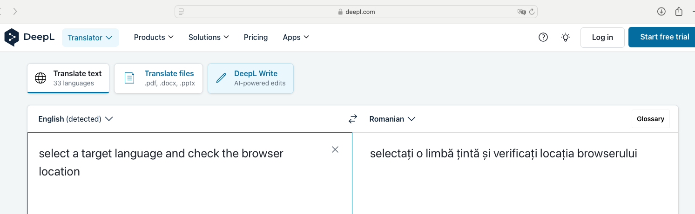
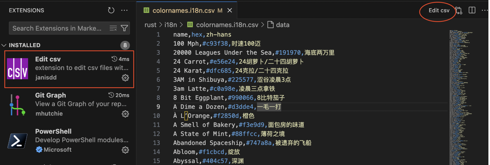
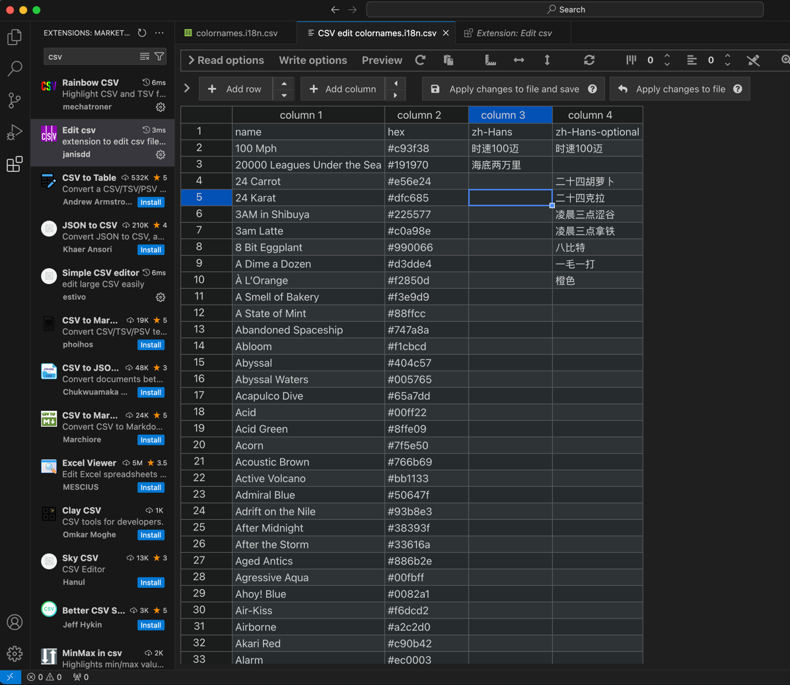

# How To

## Add a color
You should add colors in [https://github.com/meodai/color-names](https://github.com/meodai/color-names).
This tool(Color Names i18n) will automatically update them.

:::info
Only the `bestof` colors will be updated. So if you want to add a color, make sure it's the best!
:::

## Add a locale
If you click on the first column of [the table](http://localhost:3000/colornames-i18n/), Color Names i18n will take you to `deepl.com` and translate the name from english to
`the locale you selected`(not supported yet).

Select a target language on deepl.com, and the location of the browser will change.

The url would be like `https://www.deepl.com/en/translator#en/`**zh-hans**`/SomeThingNeedsToBeTranslated`.

You should use the bold part(for example, **zh-hans**) as the locale, so when you click on the English color name, we will take you to the right deepl.com page.

But it's not a requirement, you can always add a locale that does not exist on deepl.com.

After you decide your mind, search `colornames.i18n.csv` in this project, and add a column using VSCode. 

:::warning
Do not use Microsoft Excel. [See why ->](#use-vscode-to-avoid-encoding-problem)
:::

## Add/Change a translation

### Use VSCode to avoid encoding problem
Microsoft Excel will not save large amounts of characters when dealing with csv files, it will change them to `_`, which is not acceptable.

Non-English language users have to take care of these kinds of problems every day. It's racist, for anyone who needs to type letters other than a-z or 0-9...

So let's **abandon** it.

VSCode with `Edit csv` plugin is recommended, you can copy multiple lines and paste them like you did in Excel, what you see is what you save, without being fooled. Just like the way it should be. 

### Add an alternative
Colors have different names in different countries. They are not standardized in all regions.

Sometimes a color is more accurately or romantically named in your area. Or it may have several names, all of which fit perfectly.

You can add a name like:

`Name1/Name2/Name3`

`Name1` will be used to display in columns, while other names will only be displayed when the user hovers over the cell.

In addition, if a color has more than one name, the cell displays a badge that serves as a reminder of the specificity of the color.

Having multiple names for a color will always make it difficult to choose. So when enough people see the badge, someone will always come along and submit an ISSUE, and then everyone will discuss it and finally come to a consensus and fix it to one name.

That's the intent of the badge.

## Use a color
Search and copy, even try to understand the meaning behind the colors, which will take you to a whole new world.

## TODO

1. [ ] 页面点击可以跳转到 csv 的对应行 
     https://github.com/dev-easily/colornames-i18n/blob/de2b67ef21eaf417e317ad89900db99284cb9cf4/rust/i18n/colornames.i18n.csv#L8
2. [ ] ★ 页面可以显示多种语言，不仅是中文
3. [ ] 懒加载，并添加过滤和搜索功能
4. [ ] 添加一批机器翻译，并添加机器翻译的标记
5. [x] 公告栏修改为正确的连接
6. [x] docs 增加如何添加国际化的指南
7. [ ] 点击颜色代码可以复制到剪切板
8. [ ] ★ 增加json输出支持
9. [ ] ★ 增加只输出某一种语言的功能
10. [ ] 增加一个 readme
11. [ ] github action 自动更新 csv