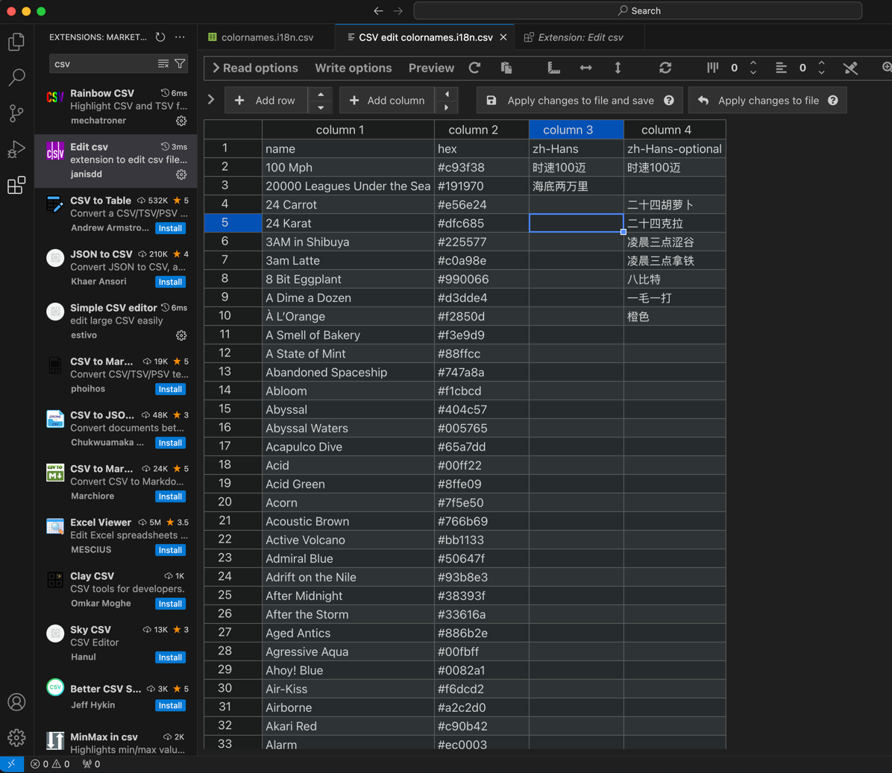

使用该工具，根据 [color names](https://github.com/meodai/color-names/blob/master/dist/colornames.bestof.csv) 生成可以预览颜色的 html 文件，
以方便后续选择颜色，并根据颜色和英文名称翻译中文名称。

# 使用指南

将 `colornames.bestof.csv` 拷贝到本项目的 csv 目录下，执行 `cargo run -- -p csv/colornames.bestof.csv`，将会在 dist 文件夹生成 html。

# vscode
excel 无法在 csv 中保存中文。建议使用 vscode，并安装 `Edit csv` 插件。

